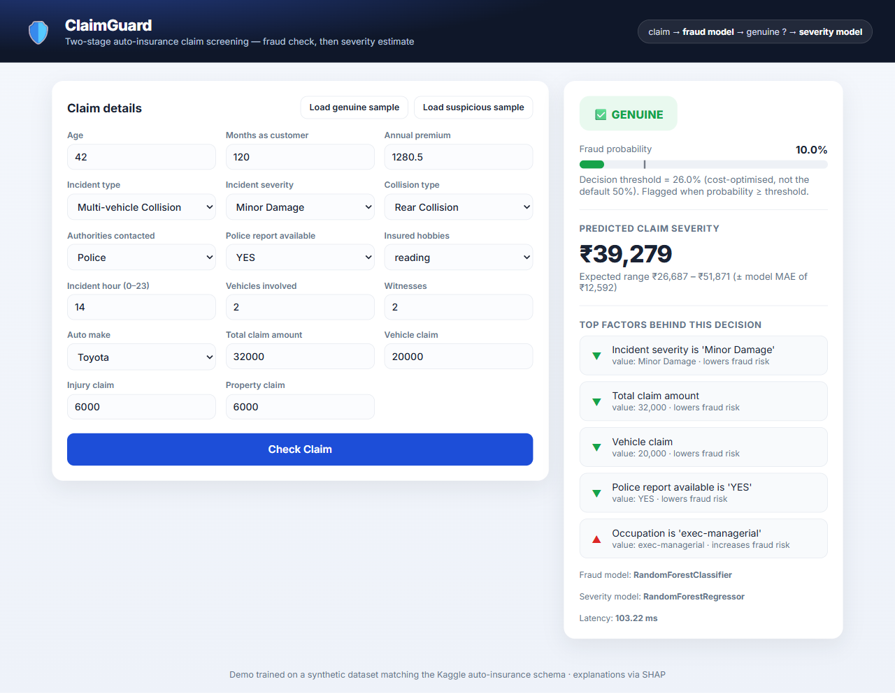
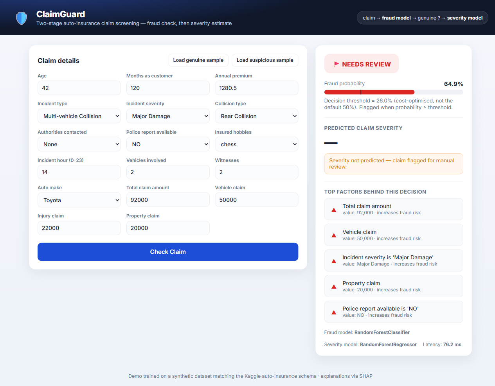

# 🛡️ ClaimGuard — Insurance Claim Fraud Detection + Severity Prediction

A **production-style, two-stage ML system** for auto-insurance claims:

1. **Stage 1 — Fraud classification.** Score whether an incoming claim is fraudulent.
2. **Stage 2 — Severity prediction.** For claims judged **genuine**, predict the claim amount
   (`total_claim_amount`) so the insurer can set an accurate reserve.

The two models are **chained**: a flagged claim returns `NEEDS REVIEW` (routed to a human, **no**
severity number); a genuine claim returns a severity estimate with an error band. Every verdict ships
with **SHAP-based, plain-English reasons**.

> **Live demo:** _<add your Render/Railway URL here after deploying — see [Deployment](#-deployment)>_
> **Shareable report:** [`reports/report.html`](reports/report.html) (self-contained, print-to-PDF)
> **Build it yourself:** [`BUILD_GUIDE.md`](BUILD_GUIDE.md) (step-by-step) · [`notebooks/fraud_severity_project.ipynb`](notebooks/fraud_severity_project.ipynb) (runnable Jupyter walkthrough)

---

## Architecture

```mermaid
flowchart LR
    A[Claim<br/>web form / API] --> B[Stage 1<br/>Fraud classifier RF]
    B --> C{P&#40;fraud&#41; ≥ 0.26?<br/>cost-optimal threshold}
    C -- "YES (fraud)" --> D[🚩 NEEDS REVIEW<br/>routed to investigator<br/>NO severity predicted]
    C -- "NO (genuine)" --> E[Stage 2<br/>Severity regressor RF<br/>genuine claims only]
    E --> F[✅ GENUINE<br/>₹ predicted severity ± MAE<br/>+ SHAP top factors]
```



A single **Flask** service ([`flask_app.py`](flask_app.py)) hosts **both** the JSON API and the web
UI, and it calls the one inference implementation ([`src/inference_pipeline.py`](src/inference_pipeline.py)).
There is no duplicated prediction logic anywhere — the web framework is just a thin shell around the
models.

| | Genuine claim | Flagged claim |
|---|---|---|
|  | GENUINE → severity estimate + factors |  → NEEDS REVIEW, no severity |

---

## Why this looks like senior work (key engineering decisions)

| Decision | Why |
|---|---|
| **Config-driven** ([`config.yaml`](config.yaml)) | Zero hardcoded paths / magic numbers. Re-point data, retune models, or change the cost matrix without touching code. |
| **One sklearn `Pipeline` per stage** (`ColumnTransformer`) | Training and serving share *identical* transforms — fitted on train only, persisted, reused at inference. No train/serve skew. |
| **PR-AUC, not accuracy** | Fraud is imbalanced (~27%); "predict genuine" scores ~78% accuracy and catches zero fraud. We select on PR-AUC and report precision/recall/F1. |
| **Cost-sensitive threshold** | The default 0.5 assumes FP cost = FN cost. A missed fraud costs **6×** a false alarm, so we sweep to the cost-minimising cut-off (**0.26**), saving **₹820k** on the test set vs 0.5. |
| **Two explicit leakage guards** | (1) Fraud claims excluded from severity training; (2) claim-component columns dropped from severity features. See [Data leakage](#data-leakage-avoidance). |
| **MLflow tracking + Model Registry** | Every run logged; the best model **registered** (versioned, promotable), not just saved. |
| **SHAP in the loop** | Global plots for the report + per-request human-readable factors in the UI. |
| **Drift monitoring (PSI) + retraining policy** | [`monitoring/drift_monitor.py`](monitoring/drift_monitor.py) — the differentiator most portfolios skip. |
| **Structured logging, custom exception, type hints, docstrings** | Production hygiene throughout — no `print()`. |
| **Tests + CI + Docker** | `pytest` (unit + API integration), GitHub Actions (lint → test → build image), multi-stage non-root Dockerfile. |

---

## Results (held-out test set)

**Stage 1 — Fraud (best: RandomForest)**

| Metric | Value |
|---|---|
| PR-AUC | **0.643** |
| ROC-AUC | 0.818 |
| Precision / Recall / F1 @ 0.5 | 0.76 / 0.47 / 0.58 |
| Recall @ cost-optimal threshold (0.26) | **~82%** |
| Cost saving vs default 0.5 | **₹820,000** (test set) |

**Stage 2 — Severity (best: RandomForest, genuine claims only)**

| Metric | Value |
|---|---|
| RMSE | ₹17,889 |
| MAE | **₹12,592** |
| R² | 0.51 |

> Metrics are on a **synthetic** dataset matching the Kaggle schema (see [Limitations](#limitations)).
> Drop the real CSV in and rerun `make train` to retrain on real data.

---

## Business impact

All assumptions are explicit; every figure is computed from them + the model's measured operating
point (see [`scripts/build_report.py`](scripts/build_report.py)).

**Assumptions:** 100,000 claims/yr · 10% production fraud rate · ₹30,000 avg fraudulent payout (FN
cost) · ₹5,000 investigation cost (FP cost) · 82% model recall, 27% FP rate at the operating threshold.

| | Per year |
|---|---|
| Annual fraud exposure | ₹300,000,000 |
| **Fraud loss prevented** (82% caught) | **₹246.7M** |
| Review cost (~32,800 claims reviewed) | ₹163.9M |
| **Net benefit** | **₹82.7M** |
| **Reserving accuracy** | MAE ₹12,592 vs ₹14,600 naïve (predict-the-mean) → **~14% lower** average reserving error per genuine claim |

---

## Data leakage avoidance

This system handles **two** distinct leakage problems — both explained in code comments and the report:

1. **Fraud claims are excluded from severity training.** A fraudulent claim's `total_claim_amount` is
   *fabricated* (what the fraudster tried to extract, not the real cost). Training the reserving model
   on those amounts would poison every genuine prediction. We also only ever predict severity for
   genuine claims in production, so train/serve populations must match.
   → [`src/severity_model.py`](src/severity_model.py) `_genuine_only()`
2. **Claim-component columns are dropped from severity features.**
   `total_claim_amount = injury_claim + property_claim + vehicle_claim` exactly, so feeding the
   components lets the model reconstruct the target (R²≈1.0) and learn nothing.
   → [`config.yaml`](config.yaml) `severity_leakage_columns`, enforced in
   [`src/feature_engineering.py`](src/feature_engineering.py).

---

## Project structure

```
.
├── src/
│   ├── config.py / config.yaml      # config-driven everything
│   ├── logger.py / exception.py     # structured logging + custom exception
│   ├── data_ingestion.py            # load + pandera schema validation + split
│   ├── feature_engineering.py       # RawFeatureEngineer + ColumnTransformer pipeline
│   ├── fraud_model.py               # Stage 1 (LR/RF/XGB) + MLflow + registry
│   ├── threshold_optimizer.py       # cost-sensitive threshold
│   ├── severity_model.py            # Stage 2 (genuine-only, log-target) + MLflow
│   ├── explainability.py            # SHAP: report plots + per-request reasons
│   ├── inference_pipeline.py        # SINGLE SOURCE OF TRUTH for chained prediction
│   ├── schemas.py                   # Pydantic request/response contracts
│   └── train.py                     # one-command end-to-end training
├── monitoring/drift_monitor.py      # PSI drift + retraining policy
├── flask_app.py                     # Flask: serves the web UI + API
├── frontend/ + static/              # the user-facing web app
├── notebooks/                       # runnable Jupyter ML walkthrough
├── scripts/                         # synthetic data + notebook + report builders
├── tests/                           # pytest unit + Flask integration tests
├── BUILD_GUIDE.md / HOW_TO_RUN.md   # build-from-scratch guide / simple run guide
├── reports/report.html              # shareable technical report (Deliverable C)
├── Dockerfile / .dockerignore       # multi-stage, non-root
├── .github/workflows/ci.yml         # lint → test → build image
├── render.yaml                      # one-click Render deploy
├── requirements.txt / -serve.txt    # full vs runtime-only deps
└── Makefile
```

---

## Quickstart (local)

```bash
# 1. install
python -m venv .venv && . .venv/Scripts/activate     # (Linux/Mac: source .venv/bin/activate)
pip install -r requirements.txt

# 2. generate the synthetic dataset (or drop the real Kaggle CSV in data/raw/)
make data        # -> data/raw/insurance_claims.csv

# 3. train everything (ingest → EDA → fraud → threshold → severity → SHAP)
make train       # writes models/, reports/plots, MLflow runs

# 4. build the shareable report
make report      # -> reports/report.html

# 5. run the app (Flask web UI + API)
make serve            # http://localhost:5000

# (optional) open the interactive Jupyter ML walkthrough
make notebook         # notebooks/fraud_severity_project.ipynb
```

> 👉 New here? See **[`HOW_TO_RUN.md`](HOW_TO_RUN.md)** for the simplest possible run instructions.

### Run with Docker

```bash
make docker-build
make docker-run            # http://localhost:8000
```

### Call the API directly

```bash
# Flask listens on :5000 locally (Docker uses :8000)
curl -s http://localhost:5000/predict -H "Content-Type: application/json" \
  -d '{"incident_severity":"Major Damage","police_report_available":"NO",
       "authorities_contacted":"None","total_claim_amount":92000,"vehicle_claim":50000}'
```

### Test & lint

```bash
make test        # pytest (unit + API integration)
make lint        # ruff
```

---

## Deployment

The trained models (~10 MB) are committed, so the image/app deploys with **no build-time training**.

**Render (recommended, free tier):**
1. Push this repo to GitHub.
2. Render dashboard → **New +** → **Blueprint** → connect the repo → **Apply**.
   Render reads [`render.yaml`](render.yaml), builds the Dockerfile, injects `$PORT`, health-checks
   `/health`, and gives you a public `https://…onrender.com` URL.
3. Put that URL in this README and in the report.

**Railway:** New Project → Deploy from GitHub → it detects the Dockerfile → exposes a public URL.

The full step-by-step (incl. `git init` and first push) is in the project hand-off notes.

---

## Limitations

- **Synthetic data.** Trains on a synthetic dataset matching the Kaggle schema (the real file is small
  and redistribution-restricted). Absolute metrics are illustrative; the *engineering* is the
  deliverable. Replace `data/raw/insurance_claims.csv` and rerun `make train`.
- **Dataset size.** Public auto-fraud datasets are ~1–2k rows; production would use far more data and
  richer behavioural/network features.
- **Drift over time.** Fraud tactics evolve and labels mature months later — hence the drift monitor
  and documented retraining triggers.
- **Cost matrix = business assumption.** The FN/FP costs should be set with claims/finance and revisited.

---

## Interview prep — likely questions & grounded answers

**1. Why exclude fraud claims from the severity model's training data?**
A fraudulent claim's amount is fabricated — it reflects what the fraudster tried to extract, not the
true cost of an incident. Training the reserving model on those values teaches it inflated amounts and
corrupts predictions for genuine claims. It also matches production: severity is only predicted for
claims judged genuine, so train and serve populations must align. (Separately, the three claim-component
columns are dropped because they sum exactly to the target — that's target leakage too.)

**2. Why not use accuracy for the fraud model?**
The target is imbalanced (~27% fraud here, far less in reality). A "predict genuine" model scores ~78%
accuracy and catches zero fraud. Accuracy rewards the majority class. I select on **PR-AUC** (precision
–recall over the positive class) and report precision/recall/F1, because they move when the model
actually gets better at finding fraud. I log accuracy/ROC-AUC too — to *show* why they mislead.

**3. How was the decision threshold chosen?**
Not 0.5 — that implicitly assumes a false positive and a false negative cost the same. I built a cost
matrix (FN = ₹30,000 missed payout, FP = ₹5,000 investigation), swept the threshold on held-out
predictions, and picked the one that minimises total expected cost (**0.26**). A missed fraud is 6×
costlier than a false alarm, so the optimum sits well below 0.5 — we accept more false alarms (routed to
human review, not auto-denial) to stop expensive fraud. It saved ₹820k on the test set vs 0.5.

**4. How do the two models interact in production?**
They're chained behind one inference function. A claim hits Stage 1; if `P(fraud) ≥ threshold` it's
flagged `NEEDS REVIEW` and we stop — no severity is produced. Only genuine claims flow to Stage 2 for a
severity estimate. The web UI and the API both call this single implementation, so behaviour can't drift
between them.

**5. How would you detect drift and decide when to retrain?**
A monitor computes **PSI** per feature between the training distribution (snapshotted at train time) and
incoming claims; PSI > 0.25 signals significant drift. Retraining triggers: (a) scheduled monthly on
matured labels, (b) drift-based from the monitor, (c) performance-based once labels mature (rolling
PR-AUC drop). New models are promoted in the MLflow registry only if they beat the current champion on a
frozen holdout (champion/challenger), then canaried before full rollout — never auto-promoted.

**6. How do you keep training and inference transformations consistent?**
All preprocessing lives in a single sklearn `Pipeline` (`ColumnTransformer` + a custom transformer),
fitted on the training fold only and persisted as one artifact. Inference loads that exact fitted object
— there is no second copy of the transform logic to drift. Unseen categories are handled by
`OneHotEncoder(handle_unknown="ignore")`, and the API validates inputs with Pydantic before they reach
the pipeline.

---

## Acknowledgements & license

Dataset schema: Kaggle "Auto Insurance Claims Fraud Detection"
(<https://www.kaggle.com/datasets/buntyshah/auto-insurance-claims-data>). Built with scikit-learn,
XGBoost, SHAP, MLflow, Flask. MIT License.
